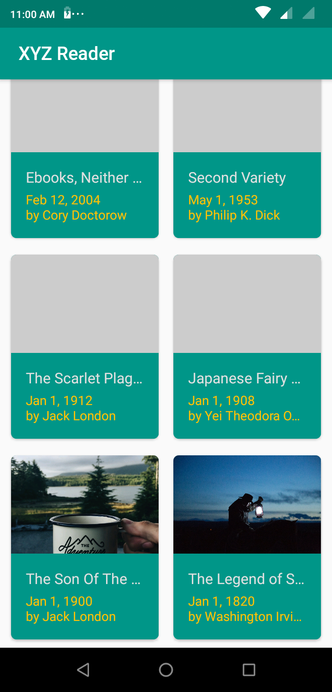
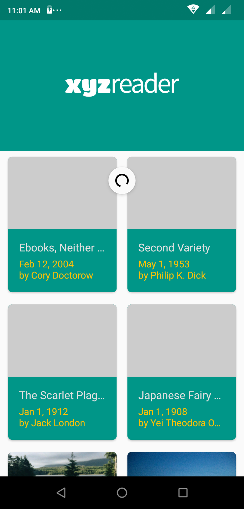
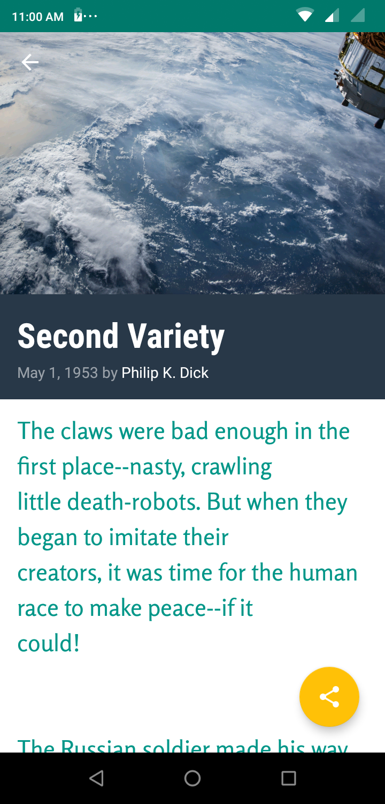
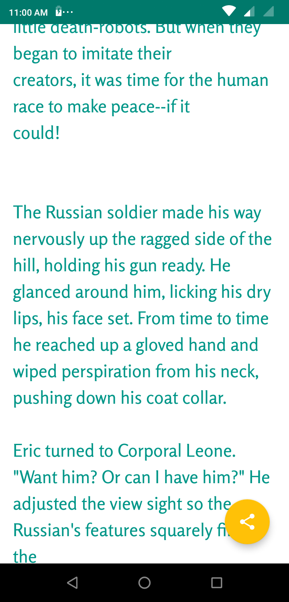

## XYZ-Reader

XYZ Reader is the app for the Udacity project Make your App Material

I have implamented the project by adding theme colors and making other changes to include a Floating Action button in the details screen

Here are the screenshots

|    |  |
| --------------------------------------------------- | ------------------------------------------------ |
|  |                 |

